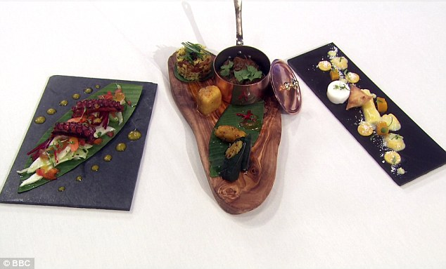
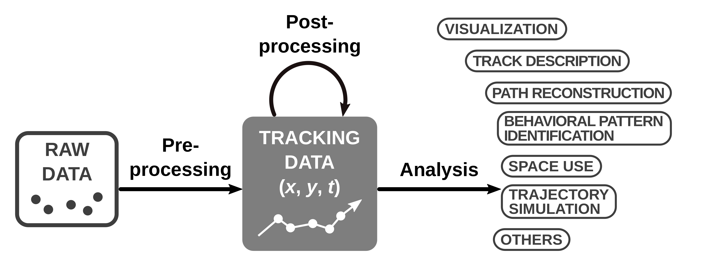
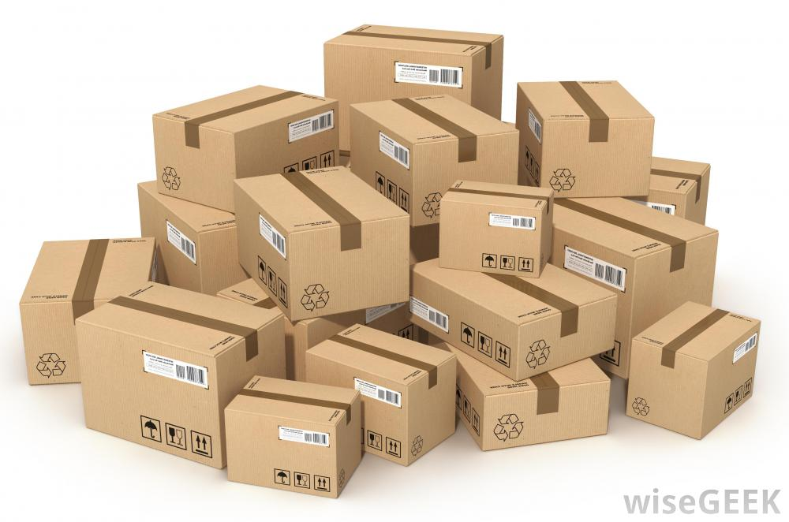

# Random thoughts...

I'll be publishing some random posts from the time to time. 

  * <a href=post-cooking.html>*Is watching a cooking show helping me become a better researcher?*</a> It's either about food or about writing scientific papers. Your choice.

{width=40%}

  * <a href=https://animalecologyinfocus.com/2020/01/17/navigating-through-the-r-packages-for-movement/>*Navigating through the R packages for movement*</a>. I published a <a href=https://besjournals.onlinelibrary.wiley.com/doi/10.1111/1365-2656.13116/>paper</a> with the same title that reviews the R packages created to process or analyze tracking data. The blog post tells the story behind the paper and gives a brief overview of the paper. It was published in the blog of Journal of Animal Ecology, Animal Ecology in Focus. 
  
  

{width=50%}

  
  * <a href=https://mablab.org/post/tracking-ctv/>*CRAN Task View: Processing and Analysis of Tracking Data*</a>. We created a CRAN Task View (CTV) on tracking packages. The blog post describes the CTV, how it will be updated and how anyone can contribute to it. 

  

{width=40%}

  <!-- * <a href=post-moveco1-intro.html>*A decade of movement ecology.*</a> Codes, data and supplementary materials for the manuscript of the same name. -->
