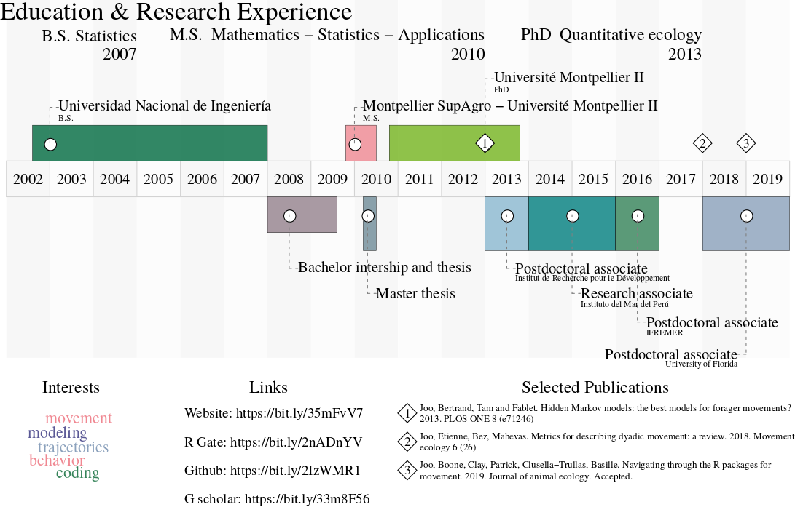

Please click <a href="CV.pdf#" class="download" title="Download CV as PDF">HERE</a>	to download a full version of my CV.

 
 

## Education

  *   2010 -- 2013 PhD in Ecosystems (Numerical Ecology), University of Montpellier 2 (UM2),
France.

  *   2009 -- 2010 Master in Mathematics, Statistics and Applications, Montpellier SupAgro -
UM2, France.

  *   2002 -- 2007 Bachelor of Engineering in Statistics, National University of Engineering (UNI),
Peru.

## Selected publications

  *   Joo, Boone, Clay, Patrick, Clusella-Trullas, Basille. Navigating through the R
packages for movement. 2019. Journal of animal ecology. Accepted. Pre-print in: https://arxiv.org/abs/1901.05935

  *   Joo, Etienne, Bez, Mahevas. Metrics for describing dyadic movement: a review. 2018. Movement ecology 6 (26). https://bit.ly/2pGNOv0

  *   Joo, Bertrand, Tam and Fablet. Hidden Markov models: the best models for forager movements? 2013. PLOS ONE 8 (e71246). https://bit.ly/32dJ8d5

## Presentations in the last year

  *   Ouden, Assink, Basille, Clay, Clusella-Trullas, Patrick, Joo, Zeyl. The SeabirdSound project (LTD). Oral communication at ‘Bio-Acoustics’. Lelystad, The Netherlands. Oct. 2019.

  *   Joo, Boone, Clay, Patrick, Clusella-Trullas, Basille. R in movement. Oral communication at the ‘LatinR’ Conference. Santiago, Chile. September 25th to 27th, 2019. In Spanish; access [here](https://bit.ly/2qjLdqO)

  *   Joo, Bertrand, Bouchon, Chaigneau, Demarcq, Tam, Simier, Segura, Gutierrez, Gutierrez, Fablet, Bertrand. How do ecosystem conditions shape fishermen spatial behaviour? The case of the Peruvian anchovy fishery in the northern Humboldt current system. Oral communication at `Scientific conference cycle at PUCP'. Lima, Peru. September 12th, 2019. In Spanish; access [here](https://bit.ly/2C9eNlB)

  *   Joo. Scientific text mining. Invited talk at ‘R-ladies meeting’. Lima, Peru. September 4th, 2019. In Spanish; access [here](https://bit.ly/2NJLz1S)

  *   Joo. Statistics and knowledge. Keynote speech at the ‘National Conference of Statistics Students’. Lima, Peru. September 2nd to 6th, 2019. In Spanish; access [here](https://bit.ly/2JPmPEm)

  *   Joo, Boone, Clay, Patrick, Clusella-Trullas, Basille. Navigating through the R packages for movement. Oral communication at the ‘useR!2019’ Conference. Toulouse, France. July 9th to 12th, 2019. Access [here](https://bit.ly/2PXg4V5) for the slides, and [here](https://bit.ly/2PKuuaH) for the video.

  *   Joo, Clay, Picardi, Boone, Patrick, Clusella-Trullas, Basille. Reviewing movement ecology: publications and R packages. Oral communication at the ‘Statistical Ecology Research Group Meeting’. Avignon, France. May 13th to 14th, 2019. Access [here](https://bit.ly/2PNdOQ8)

  *   Joo, Picardi, Clay, Boone, Patrick, Basille. Reviewing a decade of movement ecology for conservation. Oral communication at Greater Everglades Ecosystem Restoration Conference. Coral Springs, USA. April 22th to 25th, 2019. Access [here](https://bit.ly/2JRrnKi)

  *   Clay, Joo, Weimerskirch, Phillips, den Ouden, Basille, Assink, Clusella-Trullas, Patrick. Movement decisions are strongly influenced by wind conditions in a soaring seabird. Poster at the Gordon Research Conference of Movement Ecology of Animals. Barga, Italy. March 3rd to 8th, 2019.

  *   Joo, Picardi, Clay, Boone, Patrick, Basille. A decade of movement ecology. Poster at the Gordon Research Conference of Movement Ecology of Animals. Barga, Italy. March 3rd to 8th, 2019. Access [here](https://bit.ly/2WF60RQ)

## Most recent teaching activities

  *   Data Carpentry - Ecology Workshop (data organization, cleaning, management, visualization and analysis with R and SQL). Instructor and helper at the Tropical Research and Education Center, University of Florida, Homestead, USA. 14 hours. April, 2019.

  *   Hidden Markov models with MomentuHMM. Workshop instructor at the University of Liverpool, Liverpool, UK. 4 hours. May, 2018. 
  
  *   Data Carpentry - Ecology Workshop (data organization, cleaning, management, visualization and analysis with R and SQL). Instructor and helper at the Fort Lauderdale Res and Educationearch Center, University of Florida, Davie, USA. 14 hours. April, 2018.

  *   Statistics for research and R. Statistics instructor in the ‘Field Techniques and Tropical Ecology Course’ at the Cocha Cashu Biological Station, Manu National Park, Peru. 55 hours. October, 2017.

