# Fleet Dyad Paper Appendix

## Pelagic pair trawlers 

 

{width=60%}

Histogram for each group per metric.

 

### Group 1: most representative example

  

{width=40%} | 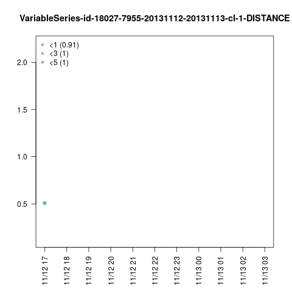{width=40%}

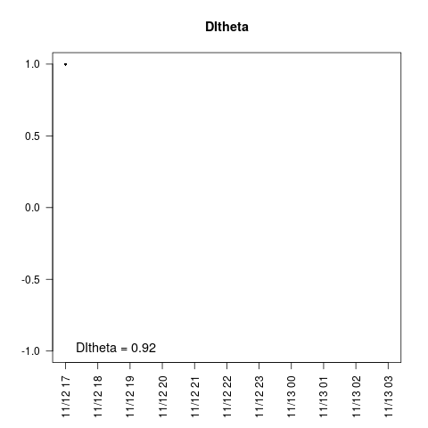{width=40%} |
{width=40%}

### Group 2: most representative example

  

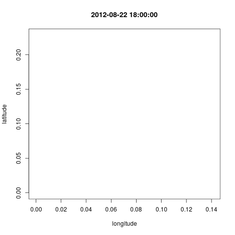{width=40%} | {width=40%}

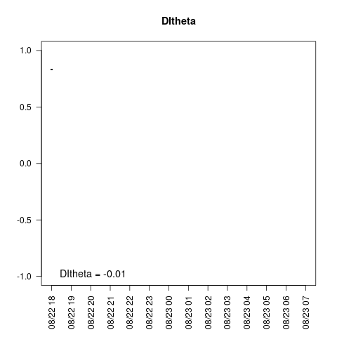{width=40%} |
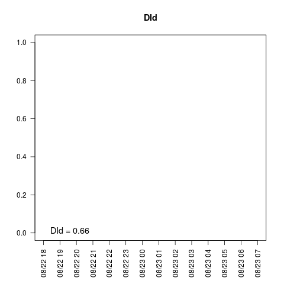{width=40%}

### Group 3: most representative example

  

{width=40%} | {width=40%}

{width=40%} |
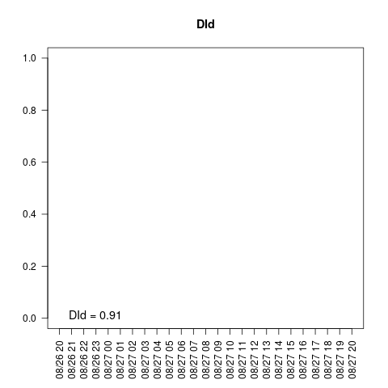{width=40%}

## Large bottom otter trawlers

 

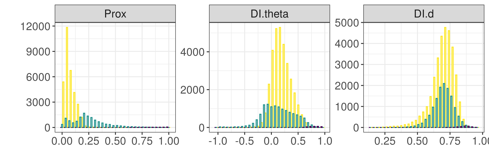{width=60%}

Histogram for each group per metric.

 

### Group 1: most representative example

  

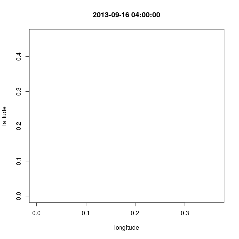{width=40%} | {width=40%}

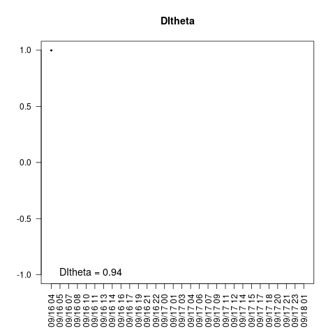{width=40%} |
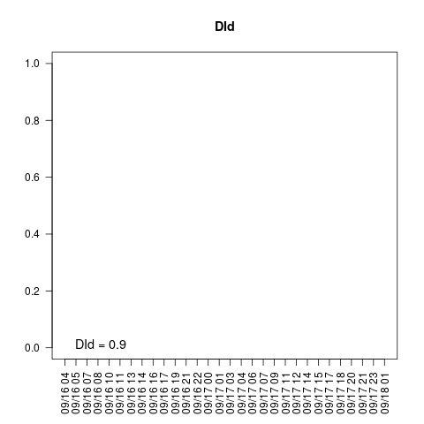{width=40%}

### Group 2: most representative example

  

{width=40%} | {width=40%}

{width=40%} |
{width=40%}

### Group 3: most representative example

  

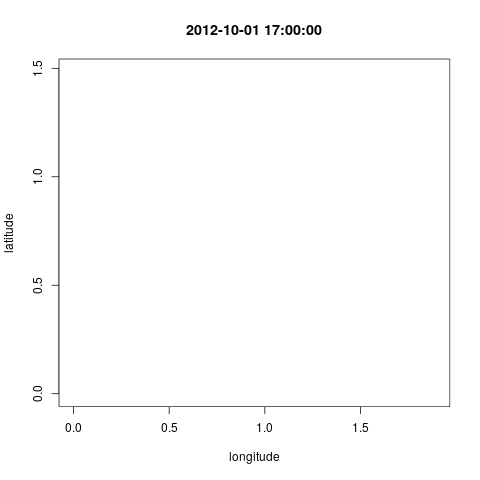{width=40%} | {width=40%}

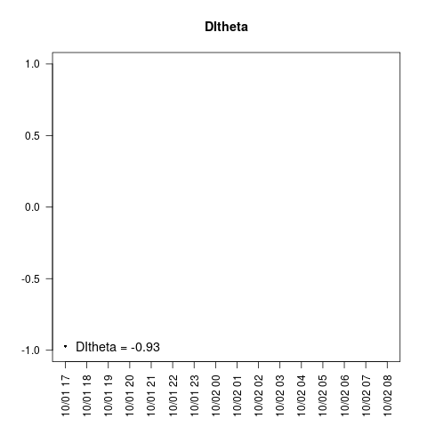{width=40%} |
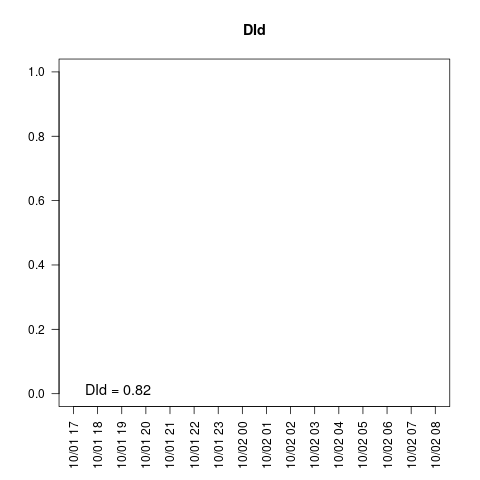{width=40%}

## Small bottom otter trawlers

 

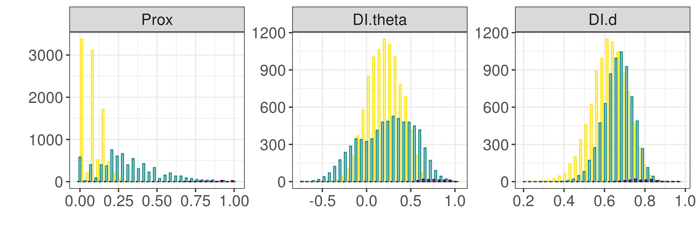{width=60%}

Histogram for each group per metric.

 

### Group 1: most representative example

  

{width=40%} | {width=40%}

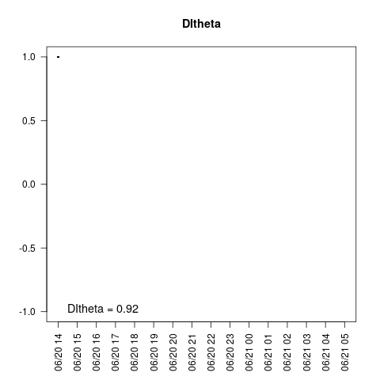{width=40%} |
{width=40%}

### Group 2: most representative example

  

{width=40%} | 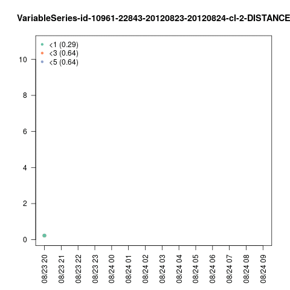{width=40%}

{width=40%} |
{width=40%}

### Group 3: most representative example

  

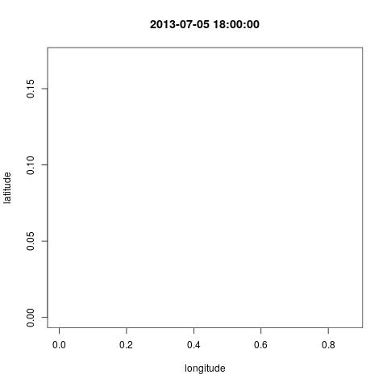{width=40%} | 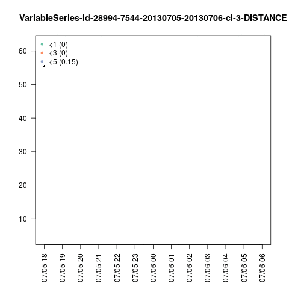{width=40%}

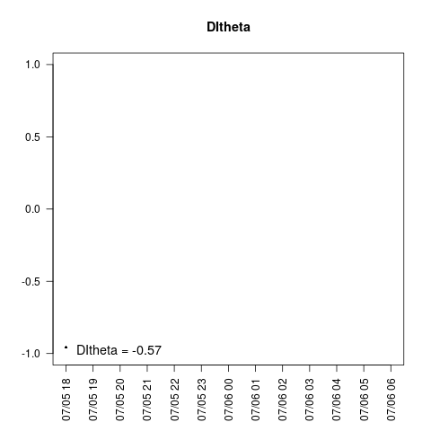{width=40%} |
{width=40%}

## Mid-water otter trawlers

 

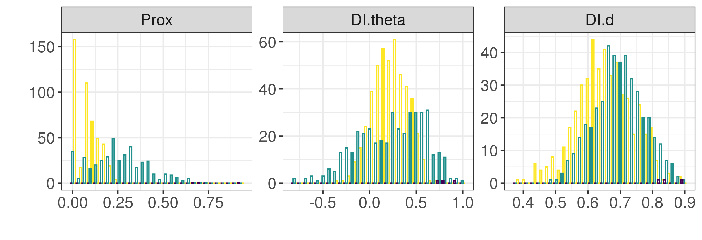{width=60%}

Histogram for each group per metric.

 

### Group 1: most representative example

  

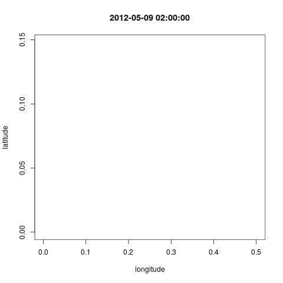{width=40%} | 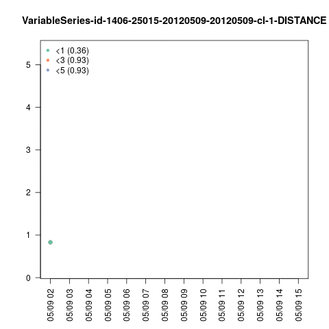{width=40%}

{width=40%} |
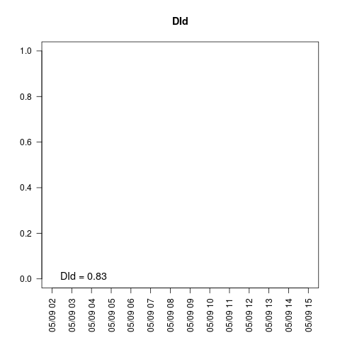{width=40%}

### Group 2: most representative example

  

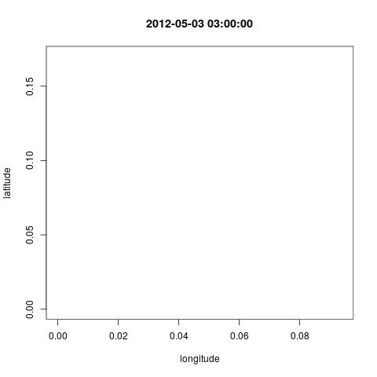{width=40%} | {width=40%}

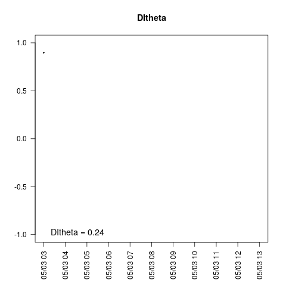{width=40%} |
{width=40%}

### Group 3: most representative example

  

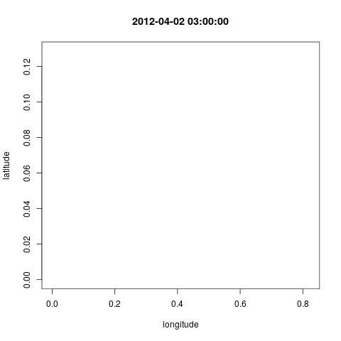{width=40%} | 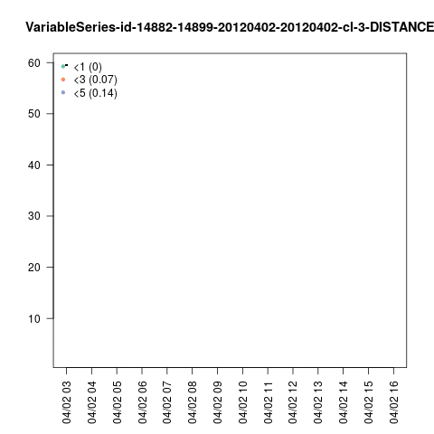{width=40%}

{width=40%} |
{width=40%}

## Anchovy purse-seiners

 

{width=60%}

Histogram for each group per metric. 

 

### Group 1: most representative example

  

{width=40%} | 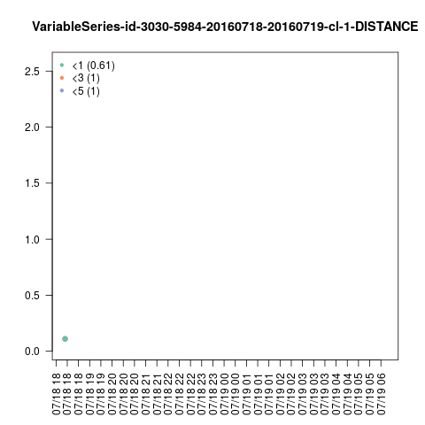{width=40%}

{width=40%} |
{width=40%}

### Group 2: most representative example

  

{width=40%} | 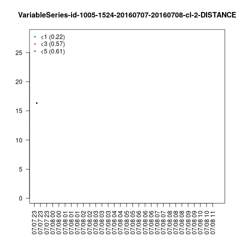{width=40%}

{width=40%} |
{width=40%}

### Group 3: most representative example

  

{width=40%} | 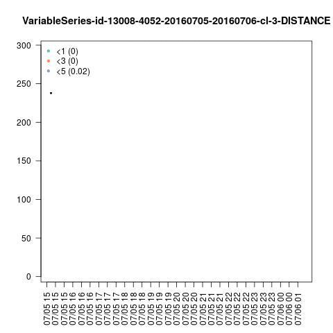{width=40%}

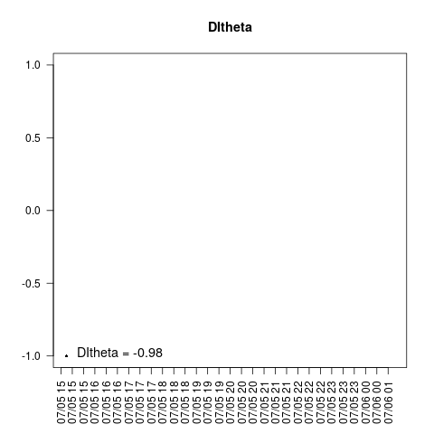{width=40%} |
{width=40%}

## Tuna purse-seiners

 

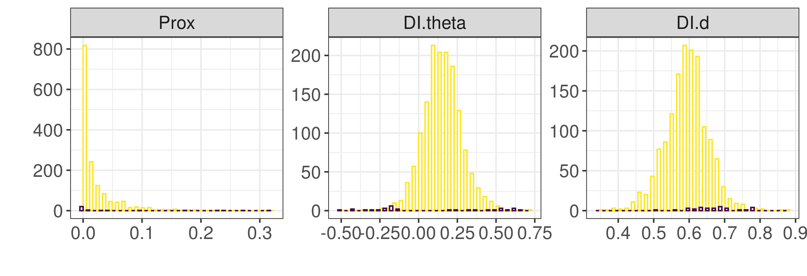{width=60%}

Histogram for each group per metric. Purple and yellow are groups 2 and 3, respectively.

 

### Group 2: most representative example

  

{width=40%} | {width=40%}

{width=40%} |
{width=40%}

### Group 3: most representative example

  

{width=40%} | {width=40%}

{width=40%} |
{width=40%}

  <!-- * <a href=post-moveco1-intro.html>*A decade of movement ecology.*</a> Codes, data and supplementary materials for the manuscript of the same name. -->
