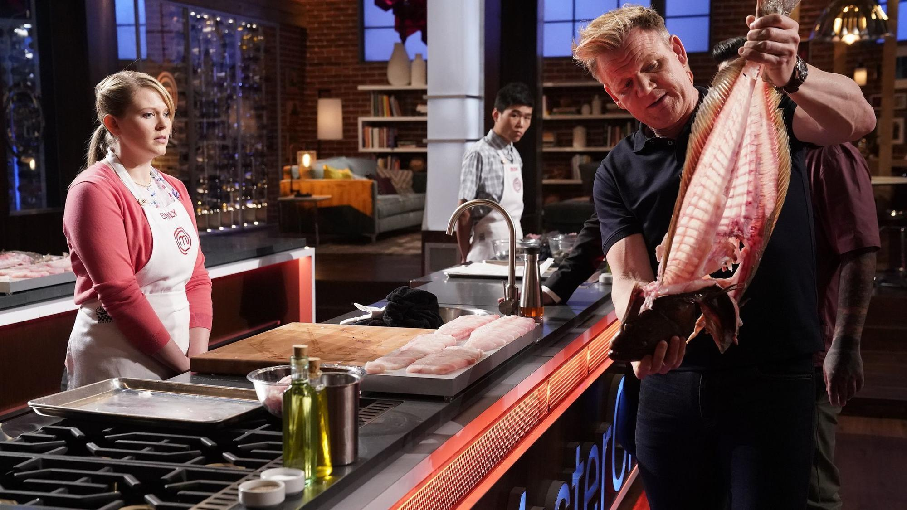

 

# Is watching a **cooking show** helping me become a better **researcher**?

 
 

{width=80%}

 

I know what you are thinking: WTF. I know, but the truth is that when watching masterchef contestants  -- UK season 10 in case you're wondering -- prepare their dishes, I couldn't help but find parallels with scientific writing. So I will write what I've learned about dishes and maybe you will, too, think about them as papers and their components, or maybe not, maybe you will just think about them as dishes and ingredients because cooking is great and food is amazing. And there's nothing wrong with thinking about food!

1. **Start with a plan.** Plan your dish before you start. You must have a vision, an idea of what your dish would look like in the end, what it would taste like, and with that in mind you can plan the different steps to get there. 

2. **Remember that you have a finite and pre-defined amount of time.** You have a deadline to deliver your dish, so your plan should be consistent with the time given, and be very aware of the time during the whole process. This could be a deadline to serve food to critics, or, in real life, to serve dinner to your guests --which is your own deadline since you're the one who fixed the time for dinner. Before the time is over, there has to be food on the plate. 

3. **Choose a star of the dish.** One element should be the star. And all of the others should work together to enhance it. They cannot compete with each other for stardom. 

4. **Every element on the plate should have its own personality.** Yes, there is a star. The star should shine not only with its own light, but with the light of all the other elements on the plate. This requires each element to be cooked in the best way possible to bring out all of its flavor and looks. 

5. **Everything has to come together.** Everything on the plate should make sense, so choose wisely. A dish should tell one story, have one message. All elements should work as a team and complement each other. And everything should be placed on the plate in a coherent way. If you have elements that are perfectly cooked but should not be there, don't be afraid to take them out if they are not working. They may be good for another dish, not this one. 

6. **Make a good sauce that connects everything in the plate.** In many cases -- maybe most cases, the dish is incomplete without a good sauce. The sauce is sometimes mistankenly neglected, though it is the glue that sticks everything together. It must have a perfect flavor, setting the tone of the dish. And perfect amount. Too little and the elements will not be linked enough. Too much and it will mask the elements you perfectly cooked. 

7. **Execute everything as best as you can.** Pay attention to the details from the moment you start cooking until you finish plating. You've chosen a few elements that should be on the dish, so when you cook them pay real attention. Don't serve them undercooked, and don't serve them overcooked. Serve them perfectly cooked for the dish you're making. It is possible to screw things up under high pressure, but try to avoid having ~~reviewers~~judges sending it back to the kitchen because they can't eat it. 

8. **Plating matters.** Presentation is nothing without great cooking, nonetheless it should not be disregarded. The presentation provides the first impression of your dish. The look of the plate attracts people, it starts exciting them, almost preparing them for your food. It is the first stage of the experience. Think about the order in which each element is plated, and in which areas you need to pour more sauce. 

9. **Give an element of surprise.** The same ingredients can be available to everybody. And chefs have had training and experience, so they are not starting from zero or inventing the wheel; their ideas may share similarities. There are going to be cooking techniques or parts of the dishes that are known, common, expected. But be creative. Each product can be cooked in many different ways. Make your dish a unique experience. Make it bring a big unexpected hit of flavor. And worth going through the experience. 

10. **Be true to yourself.** Let your dish express who you are. 
 
11. **Work hard and take risks as you go.** There is a lot of pressure. Try to cope with it without losing the joy in what you're doing. Let that joy push you and increase your level. Challenge yourself. Learn. Evolve. And, of course, there is a possibility that it won't work out. The execution could be flawed. Or the idea. It may be the end of your dish but not the end of the world.

12. **Be open to critics.** Try to use the critics to improve your cooking. And be ready for divided opinions. Not everybody has to like everything in your dish, or like your idea. It's part of taking risks. 
13. **Deal with failure.** If in the end a dish doesn't turn out like you wanted, or gets bad critics, take a moment to try to fix it. If you can't, get up and cook again. Failure is part of life.

14. **Remember that your food can be inspiring.** It can make someone's day to have a very good meal. And a truly amazing dish does not only make people happy; it's inspirational. 

If you managed to find all the parallels with scientific writing, you may think that all of these lessons on scientific writing are really obvious. It may be for many people. I just needed to watch masterchef to actually see them. And I'll try to apply this to my research. It doesn't mean that it will work out, but I'll do my best. With respect to cooking, this is way out of my league and I'm in no way trying to cook profesionally. It's still good to have these things in mind, though. 

