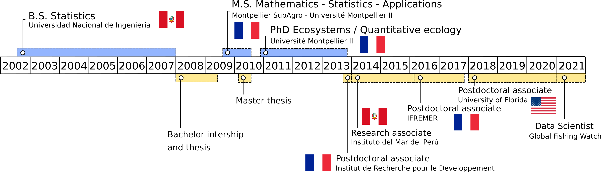

 

**Please click <a href="cv/CV.pdf#" class="download" title="Download CV as PDF">HERE</a>	to download a full version of my CV.**

 

# Summary

* **Movement**. That's my main research interest. Animal movement. Human movement. Be able to identify patterns in trajectory data; implement and develop tools to understand the drivers of movement. As a statistician, I am very much interested in models and equations, but I'm also interested in the applications: I want my research to be a contribution to the understanding of life. And to do something meaningful. In my list of publications and presentations, you'll find studies related to fishing vessel, seabird and raccoon movement, as well as more general trajectometry studies. 

* **Team work**. I value collaboration in science and in life. I've learned to work in multidisciplinary and interdisciplinary teams, with ecologists, fisheries scientists, oceanographers, engineers, data scientists, from different countries and cultures. Every experience has been challenging and full of rewards. Science is better when we work together.

* **Current position**. I'm a [data scientist at Global Fishing Watch](https://globalfishingwatch.org/meet-the-team/rocio-joo/). My main focus for now is a project to identify high risk of forced labor at sea from fishing vessel characteristics and trajectory data. 
  
  

# Timeline

# Education

  *   2010 -- 2013 PhD in Ecosystems (Quantitative Ecology), Université de Montpellier,
France.

  *   2009 -- 2010 Master in Mathematics, Statistics and Applications, Montpellier SupAgro -
Université de Montpellier, France.

  *   2002 -- 2007 Bachelor of Engineering in Statistics, Universidad Nacional de Ingeniería,
Peru.

# Selected publications

  *   Joo, Boone, Clay, Patrick, Clusella-Trullas, Basille. Navigating through the R
packages for movement. 2020. Journal of animal ecology 89 (247-267). https://besjournals.onlinelibrary.wiley.com/doi/10.1111/1365-2656.13116

  *   Joo, Etienne, Bez, Mahevas. Metrics for describing dyadic movement: a review. 2018. Movement ecology 6 (26). https://movementecologyjournal.biomedcentral.com/articles/10.1186/s40462-018-0144-2

  *   Joo, Bertrand, Tam and Fablet. Hidden Markov models: the best models for forager movements? 2013. PLOS ONE 8 (e71246). https://journals.plos.org/plosone/article?id=10.1371/journal.pone.0071246

# Presentations in the last year

  *   **Joo**. Hidden topics in documents and other text analyses. Invited talk at the 'Data Fest Tbilisi'. Virtual. December 16th, 2020. Check the slides [here](https://rociojoo.github.io/talk-DataFestTbilisi2020/Presentation.html) and watch the video [here](https://www.youtube.com/watch?v=_ze2qvQNYnw).
  
  *   **Joo**, Boone, Picardi, Romero-Romero, Clay, Patrick, Basille. Modeling research topics in movement ecology. Contributed talk at the 'Online Learning Series' of the International Biometric Conference. Virtual. July-August, 2020. Slides [here](https://github.com/rociojoo/Presentations/blob/master/Talks/2020/ibc2020.pdf)
  
  *   Dejeante, **Joo**, Boone, Basille. Trash pandas in their natural environment - or how raccoons use and abuse human trash. Contributed talk at the Annual meeting of the 'Ecological Society of America'. Virtual. August 3rd to 6th, 2020.
  
  *   Boone, **Joo**, Basille. Introducing sftrack: A framework for movement data in R. Contributed talk at the Annual meeting of the 'Ecological Society of America'. Virtual. August 3rd to 6th, 2020.

  *   Poongavanan, **Joo**, Basille. Replicability and reproducibility in movement ecology. Poster at the Annual meeting of the 'Ecological Society of America'. Virtual. August 3rd to 6th, 2020.
  
  *   **Joo**, Picardi, Boone, Clay, Clusella-Trullas, Patrick, Basille. Successes and failures of movement ecology. Contributed talk at the Annual meeting of the 'Ecological Society of America'. Virtual. August 3rd to 6th, 2020. Slides [here](https://github.com/rociojoo/Presentations/blob/master/Talks/2020/esa2020.pdf)
  
  *   **Joo**. Finding hidden topics in documents and other text analyses. Invited talk at 'R-ladies Tbilisi' meeting. Virtual. July 14th, 2020. Access the slides [here](https://github.com/rociojoo/Presentations/blob/master/Talks/2020/RladiesTbilisi2020.pdf) and watch the video [here](https://www.youtube.com/watch?v=p5asP39dXjs).
  
  *   Acion, Alfaro, Bazurto, [and 32 others, including **Joo**]. Communities of practice in Latin America: R and Friends. Contributed talk at 'useR!2020 The R User Conference'. Global virtual conference. July 6th, 2020. Watch the video [here](https://www.youtube.com/watch?v=gtRntU2J3Cg).
  
  *   **Joo**, Boone, Clay, Patrick, Clusella-Trullas, Basille. R for movement: lessons for the statistical ecology community. Oral presentation at the 'virtual International Statistical Ecology Conference'. June 22nd to 25th, 2020. Access the slides [here](https://github.com/rociojoo/Presentations/blob/master/Talks/2020/JooISEC-2020.pdf) and watch the video [here](https://www.youtube.com/watch?v=4L_gGoJtjDw&t=2s).
  
  *   Roux, Bez, **Joo**, Mahévas. An exploratory analysis of fishermen collective behaviour using graphs and graphical models. Oral communication at Moving2Gather. Rennes, France. March 12th, 2020.
  
  *   **Joo**, Boone, Calenge, Van Loon, Basille. sftrack, and R package for movement data. Oral communication at Moving2Gather. Rennes, France. March 12th, 2020. Slides [here](https://github.com/rociojoo/Presentations/blob/master/Talks/2020/sftrack-m2g-2020.pdf)
  
  *   Dejeante, **Joo**, Calenge, Van Loon, Basille. Trash pandas in their natural environment or how raccoons use and abuse human trash. Oral communication at Moving2Gather. Rennes, France. March 12th, 2020.

  
  
# Research topics

## Statistical methods to study movement

### Identifying behaviors from tracking data

Tracking devices allow us to follow the movement of humans and animals, in many cases around the globe. Because we can often record movement but not the behaviors behind them, we expect that the movement (or the absence of movement) patterns will provide information to identify these behaviors. For fisheries, identifying the behavioral modes or activities performed during fishing trips leads to better quantification of the spatial effort deployed, which can serve as inputs for management decisions and even changing the fishing quota (@Poos2010,@Hornborg2017). In ecology, identification of behaviors in animal trajectories facilitates assessing changes in migration or foraging strategies and deployment of effort. If those changes are associated with recognizable anthropogenic or environmental effects, this could lead to changes in conservation strategies. 
           
Throughout my research, I have used different methods to identify behavioral patterns from tracking data: machine learning techniques (random forests, artificial neural networks, support vector machines) and Markovian models (hidden Markov and hidden semi-Markov models; HMMs and HSMMs, respectively); in some cases, I combined the two to make hybrid models (e.g. random forests embedded into hidden Markov structures; @Joo2013b; @Maufroy2015).

#### Machine learning

The machine learning techniques I used were calibrated and validated in a supervised framework, in cases where groundtruthed data were available. These were fisheries where observers on-board a sample of fishing vessels registered when fishing sets or other types of activities were performed, like the Peruvian purse-seine anchovy fishery (@Joo2009; @Joo2011; @Joo2013), and the Mexican Yucatan fishery (@TorresRev). In the Mexican fishery, this work was a primer for their small-scale fisheries to show the potential of analyzing tracking data to infer fishing sets and quantify the fishing effort. Artisanal fisheries – worldwide – are poorly regulated, hence the relevance of this initiative. In the Peruvian fishery, the Vessel Monitoring System (VMS) data was already being used to infer fishing sets; however, the official method at the time – as in many other fisheries in the world – was a speed threshold. The overestimation of the number of fishing sets was ~182% with the speed threshold (@Bertrand2008), and was reduced to ~1% when using neural networks instead (@Joo2011). In order to get the method used in a daily basis by the Instituto del Mar del Perú (IMARPE), I first designed a graphic interface in Matlab, and when the pelagic fisheries department switched to R, I translated all codes to R. 

  <!-- * I do research in movement ecology, and before I worked with fishing vessel movement. I implement and develop tools to understand the drivers of movement. As a statistician, I am very much interested in models and equations, but I'm also interested in the applications: I want my research to be a contribution to the understanding of life. And to do something meaningful.  -->

  <!-- * Currently I'm a postdoctoral research associate at University of Florida since 2018, as a movement ecologist. -->

  <!-- * I'm Peruvian, studied and worked in France and now I'm in South Florida. I also travel a lot. I always take with me: my roots, everything I've learned from different cultures and amazing people, openness to learn more and to be surprised, and, whenever I can, a percussion instrument.  -->

  <!--  -->