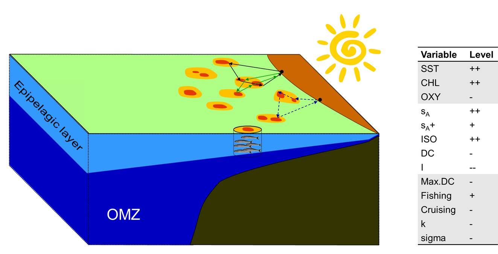
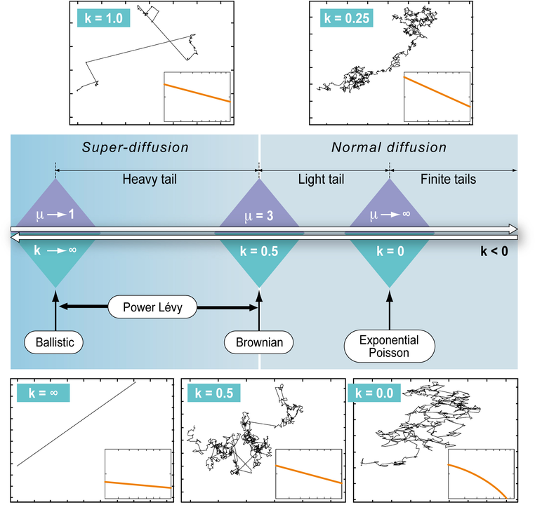

<br />

**Please click <a href="cv/CV.pdf#" class="download" title="Download CV as PDF">HERE</a>	to download a full version of my CV.**

<br />

# Summary

* **Movement**. That's my main research interest. Animal movement. Human movement. Be able to identify patterns in trajectory data; implement and develop tools to understand the drivers of movement. As a statistician, I am very much interested in models and equations, but I'm also interested in the applications: I want my research to be a contribution to the understanding of life. And to do something meaningful. In my list of publications and presentations, you'll find studies related to fishing vessel, seabird and raccoon movement, as well as more general trajectometry studies. 

* **Team work**. I value collaboration in science and in life. I've learned to work in multidisciplinary and interdisciplinary teams, with ecologists, fisheries scientists, oceanographers, engineers, data scientists, from different countries and cultures. Every experience has been challenging and full of rewards. Science is better when we work together.

* **Current position**. I'm a [data scientist at Global Fishing Watch](https://globalfishingwatch.org/meet-the-team/rocio-joo/). My main focus for now is a project to identify high risk of forced labor at sea from fishing vessel characteristics and trajectory data. 
  
  

# Timeline


# Education

  *   2010 -- 2013 PhD in Ecosystems (Quantitative Ecology), Université de Montpellier,
France.

  *   2009 -- 2010 Master in Mathematics, Statistics and Applications, Montpellier SupAgro -
Université de Montpellier, France.


  *   2002 -- 2007 Bachelor of Engineering in Statistics, Universidad Nacional de Ingeniería,
Peru.


# Selected publications

  *   Joo, Boone, Clay, Patrick, Clusella-Trullas, Basille. Navigating through the R
packages for movement. 2020. Journal of animal ecology 89 (247-267). https://besjournals.onlinelibrary.wiley.com/doi/10.1111/1365-2656.13116

  *   Joo, Etienne, Bez, Mahevas. Metrics for describing dyadic movement: a review. 2018. Movement ecology 6 (26). https://movementecologyjournal.biomedcentral.com/articles/10.1186/s40462-018-0144-2

  *   Joo, Bertrand, Tam and Fablet. Hidden Markov models: the best models for forager movements? 2013. PLOS ONE 8 (e71246). https://journals.plos.org/plosone/article?id=10.1371/journal.pone.0071246


# Presentations in the last year

  *   **Joo**. Hidden topics in documents and other text analyses. Invited talk at the 'Data Fest Tbilisi'. Virtual. December 16th, 2020. Check the slides [here](https://rociojoo.github.io/talk-DataFestTbilisi2020/Presentation.html) and watch the video [here](https://www.youtube.com/watch?v=_ze2qvQNYnw).
  
  *   **Joo**, Boone, Picardi, Romero-Romero, Clay, Patrick, Basille. Modeling research topics in movement ecology. Contributed talk at the 'Online Learning Series' of the International Biometric Conference. Virtual. July-August, 2020. Slides [here](https://github.com/rociojoo/Presentations/blob/master/Talks/2020/ibc2020.pdf)
  
  *   Dejeante, **Joo**, Boone, Basille. Trash pandas in their natural environment - or how raccoons use and abuse human trash. Contributed talk at the Annual meeting of the 'Ecological Society of America'. Virtual. August 3rd to 6th, 2020.
  
  *   Boone, **Joo**, Basille. Introducing sftrack: A framework for movement data in R. Contributed talk at the Annual meeting of the 'Ecological Society of America'. Virtual. August 3rd to 6th, 2020.

  *   Poongavanan, **Joo**, Basille. Replicability and reproducibility in movement ecology. Poster at the Annual meeting of the 'Ecological Society of America'. Virtual. August 3rd to 6th, 2020.
  
  *   **Joo**, Picardi, Boone, Clay, Clusella-Trullas, Patrick, Basille. Successes and failures of movement ecology. Contributed talk at the Annual meeting of the 'Ecological Society of America'. Virtual. August 3rd to 6th, 2020. Slides [here](https://github.com/rociojoo/Presentations/blob/master/Talks/2020/esa2020.pdf)
  
  *   **Joo**. Finding hidden topics in documents and other text analyses. Invited talk at 'R-ladies Tbilisi' meeting. Virtual. July 14th, 2020. Access the slides [here](https://github.com/rociojoo/Presentations/blob/master/Talks/2020/RladiesTbilisi2020.pdf) and watch the video [here](https://www.youtube.com/watch?v=p5asP39dXjs).
  
  *   Acion, Alfaro, Bazurto, [and 32 others, including **Joo**]. Communities of practice in Latin America: R and Friends. Contributed talk at 'useR!2020 The R User Conference'. Global virtual conference. July 6th, 2020. Watch the video [here](https://www.youtube.com/watch?v=gtRntU2J3Cg).
  
  *   **Joo**, Boone, Clay, Patrick, Clusella-Trullas, Basille. R for movement: lessons for the statistical ecology community. Oral presentation at the 'virtual International Statistical Ecology Conference'. June 22nd to 25th, 2020. Access the slides [here](https://github.com/rociojoo/Presentations/blob/master/Talks/2020/JooISEC-2020.pdf) and watch the video [here](https://www.youtube.com/watch?v=4L_gGoJtjDw&t=2s).
  
  *   Roux, Bez, **Joo**, Mahévas. An exploratory analysis of fishermen collective behaviour using graphs and graphical models. Oral communication at Moving2Gather. Rennes, France. March 12th, 2020.
  
  *   **Joo**, Boone, Calenge, Van Loon, Basille. sftrack, and R package for movement data. Oral communication at Moving2Gather. Rennes, France. March 12th, 2020. Slides [here](https://github.com/rociojoo/Presentations/blob/master/Talks/2020/sftrack-m2g-2020.pdf)
  
  *   Dejeante, **Joo**, Calenge, Van Loon, Basille. Trash pandas in their natural environment or how raccoons use and abuse human trash. Oral communication at Moving2Gather. Rennes, France. March 12th, 2020.


# Teaching resources

  *   R para Biologging. Curso online organizado por la Universidad Científica del Sur. Slides de los módulos que enseñé:
  
      *   [Hojas de cálculo](https://rociojoo.github.io/Curso-R-biologging/01-Hojas-Calculo.html)
    
      *   [Introducción a R](https://rociojoo.github.io/Curso-R-biologging/02-Intro-R.html)
    
      *   [Gráficos en R](https://rociojoo.github.io/Curso-R-biologging/03-Graficos-R.html)
    
      *   [Modelos mixtos en R](https://rociojoo.github.io/Curso-R-biologging/04-Modelos-Mixtos.html)
    
      *   [Modelos ocultos de Markov en R](https://github.com/rociojoo/Curso-R-biologging/blob/master/05-HMM.pdf)
    
      *   [Paquetes en R para biologging](https://rociojoo.github.io/Curso-R-biologging/06-Paquetes.html)
    
      *   [Rmarkdown y reproducibilidad](https://rociojoo.github.io/Curso-R-biologging/07-Rmd-Repro.html)

  *   [Movement Visualization workshop](https://rociojoo.github.io/MovementVisualization.html) for the moving2gather conference, March 11-13, Rennes, France.

  
# Research topics


## Statistical methods to study movement

### Identifying behaviors from tracking data

Tracking devices allow us to follow the movement of humans and animals, in many cases around the globe. Because we can often record movement but not the behaviors behind them, we expect that the movement (or the absence of movement) patterns will provide information to identify these behaviors. For fisheries, identifying the behavioral modes or activities performed during fishing trips leads to better quantification of the spatial effort deployed, which can serve as inputs for management decisions and even changing the fishing quota [@Poos2010; @Hornborg2017]. In ecology, identification of behaviors in animal trajectories facilitates assessing changes in migration or foraging strategies and deployment of effort. If those changes are associated with recognizable anthropogenic or environmental effects, this could lead to changes in conservation strategies. 
           
Throughout my research, I have used different methods to identify behavioral patterns from tracking data: machine learning techniques (random forests, artificial neural networks, support vector machines) and Markovian models (hidden Markov and hidden semi-Markov models; HMMs and HSMMs, respectively); in some cases, I combined the two to make hybrid models (e.g. random forests embedded into hidden Markov structures; @Joo2013b; @Maufroy2015).

#### Machine learning

The machine learning techniques I used were calibrated and validated in a supervised framework, in cases where groundtruthed data were available. These were fisheries where observers on-board a sample of fishing vessels registered when fishing sets or other types of activities were performed, like the Peruvian purse-seine anchovy fishery [@Joo2009; @Joo2011; @Joo2013], and the Mexican Yucatan fishery (@TorresRev). In the Mexican fishery, this work was a primer for their small-scale fisheries to show the potential of analyzing tracking data to infer fishing sets and quantify the fishing effort. Artisanal fisheries – worldwide – are poorly regulated, hence the relevance of this initiative. In the Peruvian fishery, the Vessel Monitoring System (VMS) data was already being used to infer fishing sets; however, the official method at the time – as in many other fisheries in the world – was a speed threshold. The overestimation of the number of fishing sets was ~182% with the speed threshold (@Bertrand2008), and was reduced to ~1% when using neural networks instead (@Joo2011). In order to get the method used in a daily basis by the Instituto del Mar del Perú (IMARPE), I first designed a graphic interface in Matlab, and when the pelagic fisheries department switched to R, I translated all codes to R. 

#### Markovian models

HMMs and HSMMs take into account the sequential nature of the tracking data through transition probabilities – and dwell-time probabilities, in the case of HSMMs. I fitted HMMs and HSMMs in a supervised framework for the Peruvian purse-seine fishery, and found that, when the goal is to infer not only fishing but several types of activities performed in a fishing trip (e.g. searching for fish, cruising), and the time spent in each activity, the Markovian models did a better job than machine learning methods (~80% of global accuracy; @Joo2013). For this case, I modified the equations and algorithms in HSMMs to work with the irregular time steps that the VMS data contained [@Joo2013b]. Because it is actually unusual to have groundtruthed data of behavioral modes (e.g. on-board data in fisheries science, or video data in animal ecology), Markovian models are commonly used in a non-supervised framework, with Expectation-Maximization algorithms for parameter estimation. Using the on-board observer data collected by IMARPE, I evaluated HMMs within supervised and non-supervised frameworks, and showed that, for the Peruvian anchovy fishing trips, the supervised method (i.e. parameter estimation using groundtruthed data) provided better results than the non-supervised one (+10% accuracy for fishing and +25% for searching activities). Results are sensitive to the number of tracks with on-board data (presented at a statistical ecology conference as @Joo2014). These findings highlight the importance of on-board observers programs in fisheries to accurately estimate fishing spatial effort, and for animal ecology, that there should be more effort into recording groundtruthed behavioral data.

```{r, out.width = "100%", fig.align='center', echo=FALSE, fig.cap = "Fig. Inferred behavioral modes. Left panel: fishing vessel track (Joo et al. 2013). Right panel: seabird track (Clay et al. 2020)."}
knitr::include_graphics("./images/StateTracks.png")
```


In settings where groundtruthed data was non-existent, we worked with non-supervised Markovian models. These were artisanal fisheries in the North-East of Brazil (HSMMs; @SantosDaSilva2017, supervision of Bachelor thesis, main advisor M. Thomé de Souza), and seabird foraging trips in Crozet and South Georgia islands (HMMs; @Clay2020). For the artisanal fisheries in Brazil, the goal was the same as in the Mexican case, to show the potential of analyzing tracking data to infer fishing activities and quantify the fishing effort. In case of seabirds, and more specifically, wandering albatrosses, we investigated the role of wind in their behavior (e.g. resting, searching, traveling) during foraging trips. We showed that wind plays an important role in their decisions to take off (from resting to traveling), and in the differences in routes that females and males choose. Wind conditions are likely to be altered in climate change scenarios, and could have drastic consequences in the fitness and survival of this soaring species. 

#### Hybrid models

Hybrid models (HSMM-neural-networks and HSMM-random-forests) were implemented for the Peruvian purse-seine fishery and the floating artificial devices (FADs) in the French tuna fishery, respectively. I implemented a hybrid HSMM-random-forest model on trajectory data from FADs to identify segments of their tracks corresponding to being on vessels, and matched those with the VMS data to identify these vessels. The model provided 97% of accuracy. Part of that work was published in @Maufroy2015. 


### Multivariate analysis and geostatistics for fishing spatial effort

A mix of multivariate methods (e.g. principal components, coinertia, hierarchical clustering) allowed me to identify tactics and strategies in the Peruvian industrial anchovy fishery, and their associations to abiotic and biotic conditions (e.g. fish spatial distribution and abundance, sea surface temperature, oxycline depth, El Niño Southern Oscillation) as well as characteristics of the vessels and the fishers themselves [@Joo2014; @Joo2015]. For those studies, data from multiple sources were used (on-board observers, raw VMS data, behavioral modes obtained with HSMMs, acoustic data from scientific surveys and satellite data). It required interdisciplinary work with oceanographers, biologists and ecologists to understand the data and the processes in the ecosystem.

```{r, out.width = "80%", fig.align='center', echo=FALSE, fig.cap = "Fig. Idealized 3D representation of ecological conditions in a given scenario, and associations with fishers spatial behavior (Joo et al. 2014)."}

```

Spatial effort from a predator can be indicative of the relative abundance and spatial distribution of their prey. With that in mind, I used the behavioral mode information from anchovy fishers to build a proxy of anchovy presence. The activities were aggregated in space and time (cells of ~25 km, 1 month) and used for variogram fitting and kriging interpolation to obtain anchovy presence maps [@Joo2013b]. Spatial descriptors were used to compare these maps to maps made from acoustic biomass of anchovy from concomitant scientific surveys. Positive spatial covariations between the two random fields were obtained at coarse scales, but no conclusive results were observed for fine scales [@Camasca2016].


### Estimating sampling effort to monitor the fishery

In IMARPE, the number of on-board observers per fishing season depended exclusively on the available budget and arbitrary decisions. They needed a robust methodology to decide on the number of observers. I developed a methodology based on simulations and resampling to assess the sensitivity of the indicators used for monitoring the fishery (e.g. catch sizes, percentage of juveniles, discards) calculated from on-board observations to the number of sampled fishing trips, thus indirectly to the number of observers. The procedure was applied to the Peruvian anchovy fishery to estimate the number of observers necessary to obtain small confidence intervals, and it can be applied to other fisheries. This study was published in Spanish in order to make the methodology more accessible to the Peruvian colleagues [@Joo2016]. I also performed a sensitivity analysis to recommend how many individuals to sample during fishing activities in order to estimate the capture sizes of the whole fishing sets [@Joo2017]. 


### A generalized approach to the random walk debate for human and animal movement

There have been (and still are) multiple debates about the choice of the best random walk model for trajectories of organisms; mainly between Brownian motion and Lévy walk supporters. Generally speaking, the methodological (empirical) part of the debate consisted in comparing the goodness-of-fit of the tail of the distribution of step lengths to Gaussian or power law distributions (corresponding to Brownian and Lévy, respectively). Instead of comparing two possibilities, in @Bertrand2015, we proposed an approach that allowed the most plausible model emerge from the data, fitting the tail of the distribution of step lengths to a Generalized Pareto distribution that included Gaussian and power law as particular cases. The method was applied to Peruvian fishing vessel and seabird tracking data. The estimated parameters of scale and diffusion from the Generalized Pareto distribution provided information on the foraging strategies of each individual.

```{r, out.width = "70%", fig.align='center', echo=FALSE, fig.cap = "Fig. Generalized Pareto Distribution, a continuum from Exponential-Poisson to Power-Lévy walk patterns: parameter k of the Generalized Pareto distribution defines a continuum of distributions from light-tailed (k<0) to heavy-tailed (k>0.5). (Bertrand et al. 2015)."}

```


### Metrics for assessing dyadic movement

From a review of collective movement literature, I identified that most data-driven works have relied on metrics that were not measuring what was intended, probably due to an absence of investigations on the theoretical properties of those metrics. For this reason, we investigated the adequacy of twelve metrics introduced in the literature for assessing joint movement by analyzing their theoretical properties and confronting them with contrasting case scenarios. Two criteria were taken into account for review of those metrics: 1) practical use, and 2) dependence on parameters and underlying assumptions. We also evaluated the ability of each metric to assess specific aspects of joint-movement behavior: proximity (closeness in space-time) and coordination (synchrony) in direction and speed. We found that some metrics are better suited to assess proximity and others are more sensitive to coordination [@Joo2018].

```{r, out.width = "100%", fig.align='center', echo=FALSE, fig.cap = "Fig. Representation of metrics in terms of their distance relative to proximity and coordination obtaining by studying their mathematical properties. (Joo et al. 2018)."}
knitr::include_graphics("./images/metrics-EN.png")
```

## Software packages to process and analyze movement data
               
R is the most used software platform in ecology [@Lai2019]. For processing/analyzing tracking data alone, there are already 58 R packages. With so many packages, users and even developers have not been able to track them all, choose the most pertinent to use for their analyses, and, in some cases, developers duplicated work without realizing it already existed. For these reasons, we reviewed the 58 tracking packages and a few more that were related to other movement data (e.g. accelerometers). We described each package based on a workflow centered around tracking data, broken down in three stages: pre-processing, post-processing and analysis (data visualization, track description, path reconstruction, behavioral pattern identification, space use characterization, trajectory simulation and others) [@Joo2020]. Links between packages were assessed through a network graph analysis and showed that one third of the packages worked on isolation, reflecting a fragmentation in the R movement-ecology programming community. We also provided recommendations for users to choose packages and for developers to maximize the usefulness of their contribution and strengthen the links between the programming community. Throughout this investigation we came to the realization that there is still a need for standardized R data classes for trajectory data. We are currently working on an R package with data classes to handle tracking data, and later connect it to the other tracking packages. This work is funded by the R Consortium. Furthermore, since R packages are dynamic (i.e. new packages are created, old packages get updated and some even disappear or get deprecated due to lack of maintenance), to keep updating the list in @Joo2020, we created a [CRAN Task View](https://cran.r-project.org/web/views/Tracking.html), that will be updated every 6 months. 

```{r, out.width = "80%", fig.align='center', echo=FALSE, fig.cap = "Fig. Network representation of the dependency and suggestion between tracking packages. The arrows go towards the package the others suggest (dashed arrows) or depend on (solid arrows). Bold font corresponds to active packages. The size of the circle is proportional to the number of packages that suggest or depend on this one (Joo et al. 2020)."}
knitr::include_graphics("./images/NetworkImportSuggestTrack.png")
```


## A text mining approach to review the field of movement ecology

The field of movement ecology has experienced unprecedented growth in the last decade: technological advances have enabled a wide range of sensors to be used by ecologists, and analytical and programming tools have been developed to aid data processing and analysis. Aiming at a comprehensive view of the state of the field, I am currently leading a synthetic and quantitative review of the scientific publications in movement ecology [@JooPreprint]. We focused on the ten-year time span between the formal introduction of the movement ecology framework (MEF) by @Nathan2008 and the end of 2018. We searched the Web of Science and obtained a database of 8007 peer-reviewed papers. We then used a text mining approach to extract text from the publications, evaluate the impact of the MEF in the literature, and assess changes in the use of technological devices, software and statistical methods. We also used Latent Dirichlet Allocation models to model the research topics in the field. We found that, while there have been major technological changes in the last decade (i.e. more use of GPS devices, accelerometers and video cameras, and a convergence towards the use of R), the focus remains on the same research questions, and more specifically, on the effect of external factors such as the environment on movement and behavior. In practice, the comprehensive approach from the MEF has not been integrated into movement ecology research. We call on researchers in movement ecology to transform the field from technology-driven to truly interdisciplinary and embracing the MEF.

Stay tuned for more!

  <!-- * I do research in movement ecology, and before I worked with fishing vessel movement. I implement and develop tools to understand the drivers of movement. As a statistician, I am very much interested in models and equations, but I'm also interested in the applications: I want my research to be a contribution to the understanding of life. And to do something meaningful.  -->

  <!-- * Currently I'm a postdoctoral research associate at University of Florida since 2018, as a movement ecologist. -->

  <!-- * I'm Peruvian, studied and worked in France and now I'm in South Florida. I also travel a lot. I always take with me: my roots, everything I've learned from different cultures and amazing people, openness to learn more and to be surprised, and, whenever I can, a percussion instrument.  -->

  <!--  -->
  
  
  
<!-- Most recent teaching activities -->

<!--     Data Carpentry - Ecology Workshop (data organization, cleaning, management, visualization and analysis with R and SQL). Instructor and helper at the Tropical Research and Education Center, University of Florida, Homestead, USA. 14 hours. April, 2019. -->

<!--     Hidden Markov models with MomentuHMM. Workshop instructor at the University of Liverpool, Liverpool, UK. 4 hours. May, 2018. -->

<!--     Data Carpentry - Ecology Workshop (data organization, cleaning, management, visualization and analysis with R and SQL). Instructor and helper at the Fort Lauderdale Res and Educationearch Center, University of Florida, Davie, USA. 14 hours. April, 2018. -->

<!--     Statistics for research and R. Statistics instructor in the ‘Field Techniques and Tropical Ecology Course’ at the Cocha Cashu Biological Station, Manu National Park, Peru. 55 hours. October, 2017. -->

