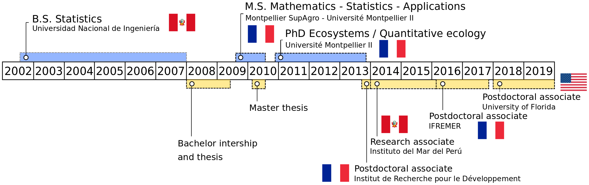

 

**Please click <a href="cv/CV.pdf#" class="download" title="Download CV as PDF">HERE</a>	to download a full version of my CV.**

 

# Summary

* **Movement**. I do research in movement ecology, and before I worked with fishing vessel movement. I implement and develop tools to understand the drivers of movement. As a statistician, I am very much interested in models and equations, but I'm also interested in the applications: I want my research to be a contribution to the understanding of life. And to do something meaningful. 

* **Team work**. I value collaboration in science. I've learned to work in multidisciplinary and interdisciplinary teams, with ecologists, fisheries scientists, oceanographers, engineers, data scientists, from different countries and cultures. Every experience has been challenging and full of rewards. Science is better when we work together. 

* **Current position**. I'm a postdoctoral research associate at University of Florida since 2018, leading the movement ecology work package of the <a href=https://seabirdsound.org/>Seabirdsound project</a>
  
  

# Timeline

# Education

  *   2010 -- 2013 PhD in Ecosystems (Quantitative Ecology), University of Montpellier 2 (UM2),
France.

  *   2009 -- 2010 Master in Mathematics, Statistics and Applications, Montpellier SupAgro -
UM2, France.

  *   2002 -- 2007 Bachelor of Engineering in Statistics, National University of Engineering (UNI),
Peru.

# Selected publications

  *   Joo, Boone, Clay, Patrick, Clusella-Trullas, Basille. Navigating through the R
packages for movement. 2020. Journal of animal ecology 89 (247-267). https://besjournals.onlinelibrary.wiley.com/doi/10.1111/1365-2656.13116

  *   Joo, Etienne, Bez, Mahevas. Metrics for describing dyadic movement: a review. 2018. Movement ecology 6 (26). https://movementecologyjournal.biomedcentral.com/articles/10.1186/s40462-018-0144-2

  *   Joo, Bertrand, Tam and Fablet. Hidden Markov models: the best models for forager movements? 2013. PLOS ONE 8 (e71246). https://journals.plos.org/plosone/article?id=10.1371/journal.pone.0071246

# Presentations in the last and present year

  *   Roux, Bez, **Joo**, Mahévas. An exploratory analysis of fishermen collective behaviour using graphs and graphical models. Oral communication at Moving2Gather. Rennes, France. March 12th, 2020.
  
  *   **Joo**, Boone, Calenge, Van Loon, Basille. sftrack, and R package for movement data. Oral communication at Moving2Gather. Rennes, France. March 12th, 2020. Access [here](https://github.com/rociojoo/Presentations/blob/master/Talks/2020/sftrack-m2g-2020.pdf)
  
  *   Dejeante, **Joo**, Calenge, Van Loon, Basille. Trash pandas in their natural environment or how raccoons use and abuse human trash. Oral communication at Moving2Gather. Rennes, France. March 12th, 2020.

  *   **Joo**. Text mining of scientific papers with R. Invited talk at ‘R-ladies meeting’. Miami, USA. November 26th, 2019. Access [here](https://bit.ly/2SAwWlx) for slides, and [here](https://bit.ly/2MDcfBI) for scripts.
  
  *   Ouden, Assink, Basille, Clay, Clusella-Trullas, Patrick, **Joo**, Zeyl. The SeabirdSound project (LTD). Oral communication at ‘Bio-Acoustics’. Lelystad, The Netherlands. Oct. 2019.

  *   **Joo**, Boone, Clay, Patrick, Clusella-Trullas, Basille. R in movement. Oral communication at the ‘LatinR’ Conference. Santiago, Chile. September 25th to 27th, 2019. In Spanish; access [here](https://bit.ly/2qjLdqO)

  *   **Joo**, Bertrand, Bouchon, Chaigneau, Demarcq, Tam, Simier, Segura, Gutierrez, Gutierrez, Fablet, Bertrand. How do ecosystem conditions shape fishermen spatial behaviour? The case of the Peruvian anchovy fishery in the northern Humboldt current system. Oral communication at `Scientific conference cycle at PUCP'. Lima, Peru. September 12th, 2019. In Spanish; access [here](https://bit.ly/2C9eNlB)

  *   **Joo**. Scientific text mining. Invited talk at ‘R-ladies meeting’. Lima, Peru. September 4th, 2019. In Spanish; access [here](https://bit.ly/2NJLz1S)

  *   **Joo**. Statistics and knowledge. Keynote speech at the ‘National Conference of Statistics Students’. Lima, Peru. September 2nd to 6th, 2019. In Spanish; access [here](https://bit.ly/2JPmPEm)

  *   **Joo**, Boone, Clay, Patrick, Clusella-Trullas, Basille. Navigating through the R packages for movement. Oral communication at the ‘useR!2019’ Conference. Toulouse, France. July 9th to 12th, 2019. Access [here](https://bit.ly/2PXg4V5) for the slides, and [here](https://bit.ly/2PKuuaH) for the video.

  *   **Joo**, Clay, Picardi, Boone, Patrick, Clusella-Trullas, Basille. Reviewing movement ecology: publications and R packages. Oral communication at the ‘Statistical Ecology Research Group Meeting’. Avignon, France. May 13th to 14th, 2019. Access [here](https://bit.ly/2PNdOQ8)

  *   **Joo**, Picardi, Clay, Boone, Patrick, Basille. Reviewing a decade of movement ecology for conservation. Oral communication at Greater Everglades Ecosystem Restoration Conference. Coral Springs, USA. April 22th to 25th, 2019. Access [here](https://bit.ly/2JRrnKi)

  *   Clay, **Joo**, Weimerskirch, Phillips, den Ouden, Basille, Assink, Clusella-Trullas, Patrick. Movement decisions are strongly influenced by wind conditions in a soaring seabird. Poster at the Gordon Research Conference of Movement Ecology of Animals. Barga, Italy. March 3rd to 8th, 2019.

  *   **Joo**, Picardi, Clay, Boone, Patrick, Basille. A decade of movement ecology. Poster at the Gordon Research Conference of Movement Ecology of Animals. Barga, Italy. March 3rd to 8th, 2019. Access [here](https://bit.ly/2WF60RQ)

# Research topics

## Statistical methods to study movement

### Identifying behaviors from tracking data

Tracking devices allow us to follow the movement of humans and animals, in many cases around the globe. Because we can often record movement but not the behaviors behind them, we expect that the movement (or the absence of movement) patterns will provide information to identify these behaviors. For fisheries, identifying the behavioral modes or activities performed during fishing trips leads to better quantification of the spatial effort deployed, which can serve as inputs for management decisions and even changing the fishing quota (@Poos2010,@Hornborg2017). In ecology, identification of behaviors in animal trajectories facilitates assessing changes in migration or foraging strategies and deployment of effort. If those changes are associated with recognizable anthropogenic or environmental effects, this could lead to changes in conservation strategies. 
           
Throughout my research, I have used different methods to identify behavioral patterns from tracking data: machine learning techniques (random forests, artificial neural networks, support vector machines) and Markovian models (hidden Markov and hidden semi-Markov models; HMMs and HSMMs, respectively); in some cases, I combined the two to make hybrid models (e.g. random forests embedded into hidden Markov structures; @Joo2013b; @Maufroy2015).

#### Machine learning

The machine learning techniques I used were calibrated and validated in a supervised framework, in cases where groundtruthed data were available. These were fisheries where observers on-board a sample of fishing vessels registered when fishing sets or other types of activities were performed, like the Peruvian purse-seine anchovy fishery (@Joo2009; @Joo2011; @Joo2013), and the Mexican Yucatan fishery (presented at an international conference on coastal fisheries as Torres et al. 2014). In the Mexican fishery, this work was a primer for their small-scale fisheries to show the potential of analyzing tracking data to infer fishing sets and quantify the fishing effort. Artisanal fisheries – worldwide – are poorly regulated, hence the relevance of this initiative. In the Peruvian fishery, the Vessel Monitoring System (VMS) data was already being used to infer fishing sets; however, the official method at the time – as in many other fisheries in the world – was a speed threshold. The overestimation of the number of fishing sets was ~182% with the speed threshold (Bertrand et al. 2008), and was reduced to ~1% when using neural networks instead (Joo et al. 2011). In order to get the method used in a daily basis by the Instituto del Mar del Perú (IMARPE), I first designed a graphic interface in Matlab, and when the pelagic fisheries department switched to R, I translated all codes to R. 

  <!-- * I do research in movement ecology, and before I worked with fishing vessel movement. I implement and develop tools to understand the drivers of movement. As a statistician, I am very much interested in models and equations, but I'm also interested in the applications: I want my research to be a contribution to the understanding of life. And to do something meaningful.  -->

  <!-- * Currently I'm a postdoctoral research associate at University of Florida since 2018, as a movement ecologist. -->

  <!-- * I'm Peruvian, studied and worked in France and now I'm in South Florida. I also travel a lot. I always take with me: my roots, everything I've learned from different cultures and amazing people, openness to learn more and to be surprised, and, whenever I can, a percussion instrument.  -->

  <!--  -->